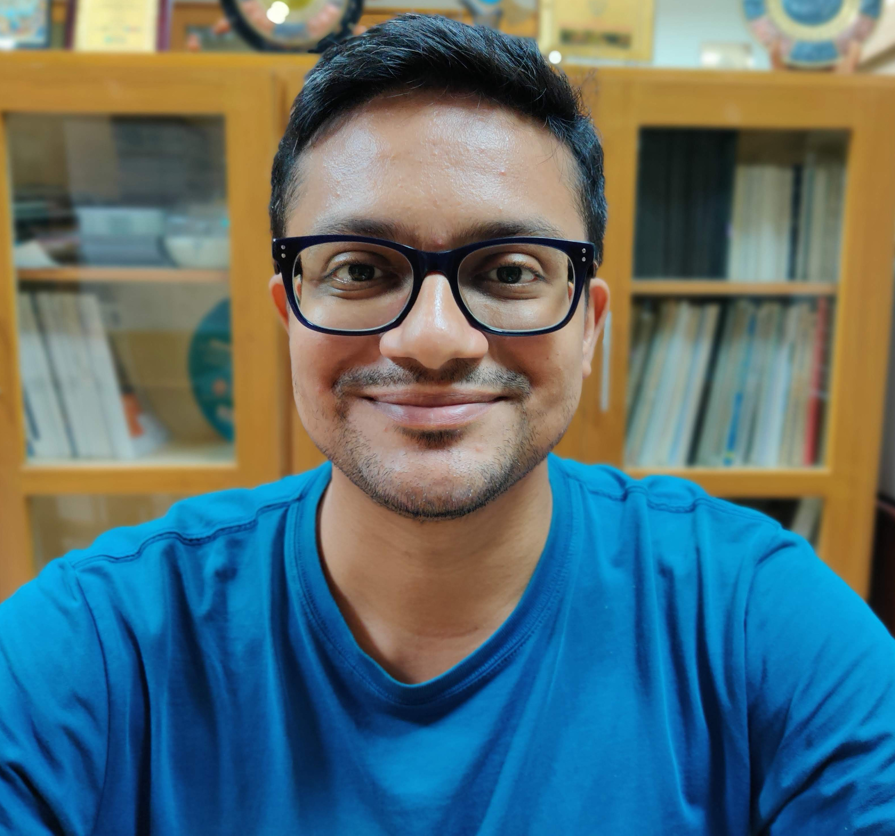

## About Me:

I am a Postdoctoral Researcher at the Department of Marine Sciences, Gothenburg University, Sweden. I am working on Southern Ocean dynamics with Fabien Roquet under the SO-CHIC project.

[My Full CV](https://github.com/adityarn/CV/CV.pdf)

## Research Interests

1. Open ocean polynya.
1. Southern Ocean dynamics.
1. Antarctic continental shelf and continental shelf break processes.
1. Production of Dense Shelf Waters. 
1. Circumpolar Deep Water intrusion onto the continental shelf.
1. Coast-ward heat transport around Antarctica.

## Publications
    
### Journals

1.  Narayanan, A., Gille, S. T., Mazloff, M., & Murali, K. (2019). Water mass characteristics of the Antarctic margins and the production and seasonality of Dense Shelf Water. Journal of Geophysical Research: Oceans; [DOI](https://doi.org/10.1029/2018JC014907); [Click here for open access](https://escholarship.org/uc/item/9fx3m2rx)

### Reports

1. Queste, B. Y., E. P. Abrahamsen, M. D. du Plessis, S. T. Gille, L. Gregor, M. R. Mazloff, A. Narayanan, F. Roquet, and S. Swart, (2020), "Southern Ocean" [in "State of the Climate in 2019"], \emph{Bull. Amer. Meteor. Soc.}, 101, S307-S309, [DOI](https://doi.org/10.1175/BAMS-D-20-0090.1)
    
### Under review

1.  **2021:** **Narayanan, A., Gille, S. T., Mazloff, M., Roquet, F., duPlessis, M., & Murali, K. Interaction of Circumpolar Deep Water with large-scale circulation and shelf water masses in the Southern Ocean** -- Under review, study analyses the distribution of Circumpolar Deep Water over the continental slope and offshore regions around Antarctica using tagged seals data and Argo data, supplemented by a 1/12o Southern Ocean model.

### Conferences

1.  [Aditya Narayanan, Sarah T. Gille, Matthew Mazloff, Murali K, (2019), <strong> "<em> Antarctic Shelf Break Processes and Circumpolar Deep Water Intrusion </em>", </strong> AGU Fall Meeting, San Fransisco.](https://agu.confex.com/agu/fm19/meetingapp.cgi/Paper/505561)
1. Aditya Narayanan, Sarah T. Gille, Matthew Mazloff, Murali K, (2019), "<em>Antarctic shelf break processes and their role in determining the bottom temperature regime of the shelf seas</em>", National Conference on Polar Sciences, National Centre for Polar and Ocean Research, Goa, India.
1. Aditya Narayanan, Murali K. (2018), "<em>Analysis of Turbulence in the Weddell Sea: Observations and Modeling</em>", Ocean Sciences Meeting, Portland.
1. Aditya Narayanan, Murali K. (2016), "<em>Mathematical and numerical modeling of the physics of cold water downslope flows</em>", CLIVAR Open Science Conference, Qingdao.

## Code

1. [Github repositories](https://github.com/adityarn)
1. [Open Science Foundation repositories](https://osf.io/gcjbk/)

## Collaborators

1. [Sarah T. Gille](http://pordlabs.ucsd.edu/sgille/), Scripps Institution of Oceanography, University of California San Diego.
1. [Matthew Mazzloff](http://scrippsscholars.ucsd.edu/mmazloff), Scripps Institution of Oceanography, University of California San Diego.
1. [Fabien Roquet](http://fabien-roquet.com/), Department of Marine Sciences, Gothenburg University.
1. [Marcel du Plessis](https://mduplessis.com/), Department of Marine Sciences, Gothenburg University.
1. [Murali K.](http://www.doe.iitm.ac.in/murali/), Department of Ocean Engineering, IIT Madras, Chennai (Ph.D. supervisor).

## Contact

1. Email: adityarn@gmail.com, aditya.narayanan@gu.se
1. [ORCID: ](https://orcid.org/0000-0002-8967-2211)
1. [Twitter: ](https://twitter.com/aditrn)
