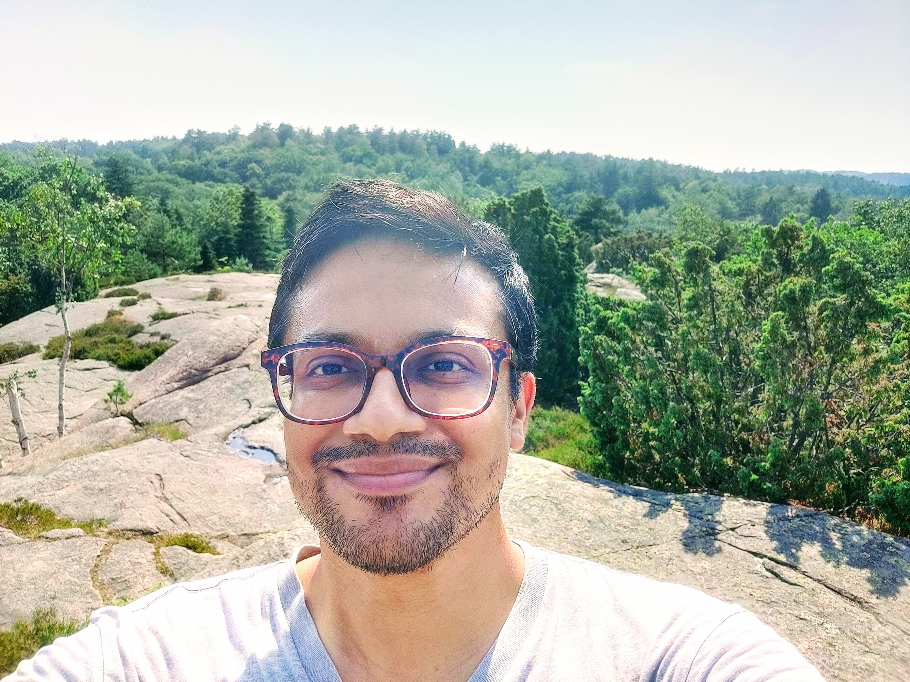

**(He/Him)**

## About Me:

I am a Postdoctoral Researcher at the Department of Marine Sciences, Gothenburg University, Sweden. I am working on Southern Ocean dynamics with Fabien Roquet under the SO-CHIC project. 

[My Full CV](https://raw.githubusercontent.com/adityarn/CV/master/CV.pdf)

**[Contact](#contact):** adityarn@gmail.com, aditya.narayanan@gu.se

## Research Interests

1. Open ocean polynya.
1. Southern Ocean dynamics.
1. Antarctic continental shelf and continental shelf break processes.
1. Production of Dense Shelf Waters. 
1. Circumpolar Deep Water intrusion onto the continental shelf.
1. Coast-ward heat transport around Antarctica.

## Publications
    
### Journals

1.  Narayanan, A., Gille, S. T., Mazloff, M., & Murali, K. (2019). Water mass characteristics of the Antarctic margins and the production and seasonality of Dense Shelf Water. Journal of Geophysical Research: Oceans; [DOI](https://doi.org/10.1029/2018JC014907); [Click here for open access](https://escholarship.org/uc/item/9fx3m2rx)

    
### Under Review (Contact me for drafts)

1.  **2021:** **Narayanan, A., Gille, S. T., Mazloff, M., duPlessis, M., & Murali, K., Roquet, F. Interaction of Circumpolar Deep Water with large-scale circulation and shelf water masses in the Southern Ocean** -- Under review, study analyses the distribution of Circumpolar Deep Water over the continental slope and offshore regions around Antarctica using tagged seals data and Argo data, supplemented by a 1/12o Southern Ocean model.
2. **2022:** **Narayanan, A., Roquet, F., G&uuml;lk, B., Mazloff, M., Silvano, A., Gille, S. T., Garabato, A., N. Weddell Gyre interaction with seamount enabled recent polynya formation** -- Under review, study analyses the complex flow -- topography interaction on the northern flank of the Maud Rise seamound in the Weddell Sea and identifies a novel mechanism that aided the formation of the 2017 polynya. Study uses the Southern Ocean State Estimate, a 1/6o Southern Ocean model.

### Upcoming

1. A study of the variability of the Weddell Gyre using remotely sensed sea level anomalies.

### Reports

1. Queste, B. Y., E. P. Abrahamsen, M. D. du Plessis, S. T. Gille, L. Gregor, M. R. Mazloff, A. Narayanan, F. Roquet, and S. Swart, (2020), "Southern Ocean" [in "State of the Climate in 2019"], \emph{Bull. Amer. Meteor. Soc.}, 101, S307-S309, [DOI](https://doi.org/10.1175/BAMS-D-20-0090.1)

### Conferences

1. [Aditya Narayanan, Birte Gülk, Fabien Roquet, and Alberto Naveira Garabato, (2022), <strong> "<em> The oceanic drivers of the 2017 Maud Rise Polynya</em>", </strong> EGU General Assembly, Vienna](https://meetingorganizer.copernicus.org/EGU22/EGU22-9100.html)
1.  [Aditya Narayanan, Sarah T. Gille, Matthew Mazloff, Murali K, (2019), <strong> "<em> Antarctic Shelf Break Processes and Circumpolar Deep Water Intrusion </em>", </strong> AGU Fall Meeting, San Fransisco.](https://agu.confex.com/agu/fm19/meetingapp.cgi/Paper/505561)
1. Aditya Narayanan, Sarah T. Gille, Matthew Mazloff, Murali K, (2019), "<em>Antarctic shelf break processes and their role in determining the bottom temperature regime of the shelf seas</em>", National Conference on Polar Sciences, National Centre for Polar and Ocean Research, Goa, India.
1. Aditya Narayanan, Murali K. (2018), "<em>Analysis of Turbulence in the Weddell Sea: Observations and Modeling</em>", Ocean Sciences Meeting, Portland.
1. Aditya Narayanan, Murali K. (2016), "<em>Mathematical and numerical modeling of the physics of cold water downslope flows</em>", CLIVAR Open Science Conference, Qingdao.

## Code and Open Data

1. [Github repositories](https://github.com/adityarn)
1. [Open Science Foundation repositories](https://osf.io/gcjbk/)

## Collaborators

 <b>(click to expand)</b> 

1. [Sarah T. Gille](http://pordlabs.ucsd.edu/sgille/), Scripps Institution of Oceanography, University of California San Diego.
1. [Matthew Mazzloff](http://scrippsscholars.ucsd.edu/mmazloff), Scripps Institution of Oceanography, University of California San Diego.
1. [Fabien Roquet](http://fabien-roquet.com/), Department of Marine Sciences, Gothenburg University.
1. [Marcel du Plessis](https://mduplessis.com/), Department of Marine Sciences, Gothenburg University.
2. [Sabu P.](https://ncpor.res.in/profiles/details/115), National Centre for Polar and Ocean Research, Ministry of Earth Sciences, Government of India.
2. [Alberto Naveira Garabato](https://orcid.org/0000-0001-6071-605X), National Oceanography Centre, University of Southampton.
3. Birte G&uuml;lk, Department of Marine Sciences, Gothenburg University.
1. [Murali K.](http://www.doe.iitm.ac.in/murali/), Department of Ocean Engineering, IIT Madras, Chennai (Ph.D. supervisor).

## Talks Online

1. 2022: [Webinar on the EU funded project: Southern Ocean Carbon and Heat Impacts on Climate (SOCHIC)](https://www.youtube.com/watch?v=Usky53wAa80)
1. 2021: [Webinar on the Weddell Sea polynyas](https://www.youtube.com/watch?v=C1HVuRRD-fI&t=304s)

## Contact

1. Postal address: Box 461, 40530, Gothenburg, Sweden.
1. Visiting address: Carl Skottsberg Gata 22B, Department of Marine Sciences, University of Gothenburg, 41319, Gothenburg, Sweden.
1. [ORCID: 0000-0002-8967-2211](https://orcid.org/0000-0002-8967-2211)
